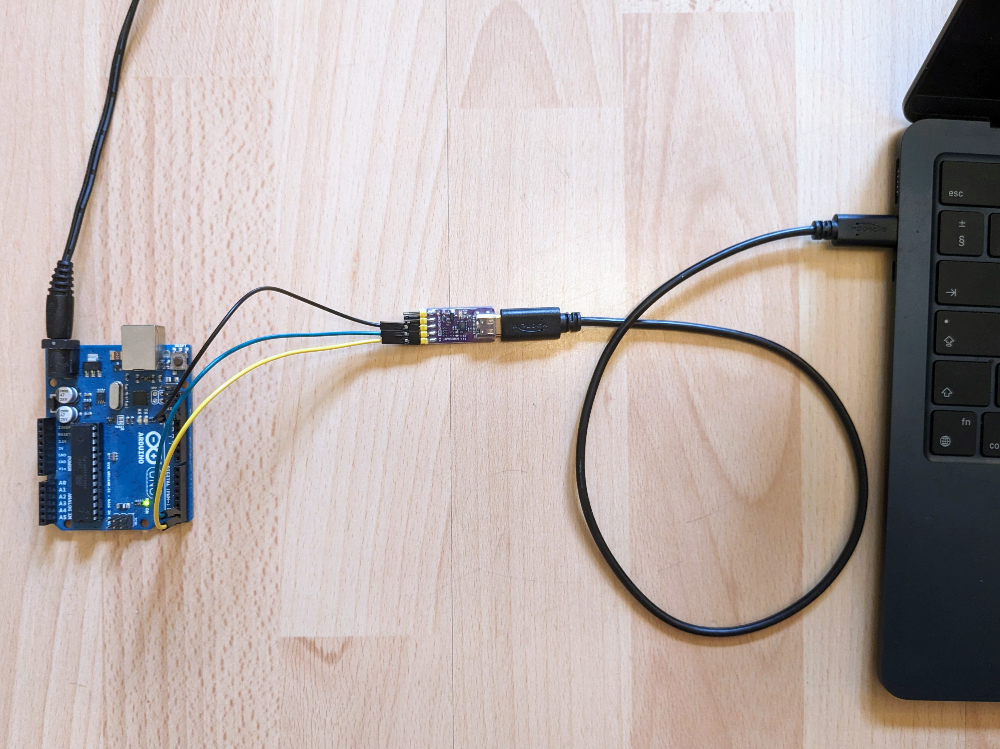
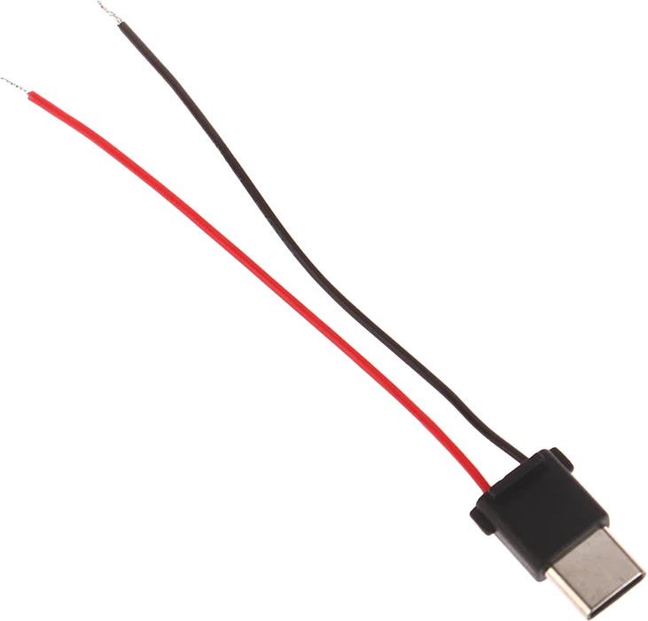
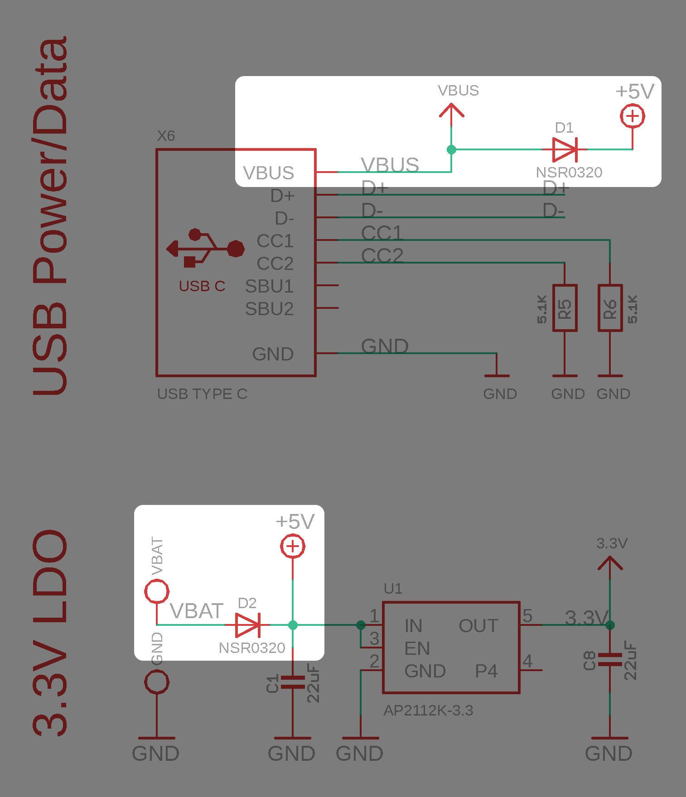
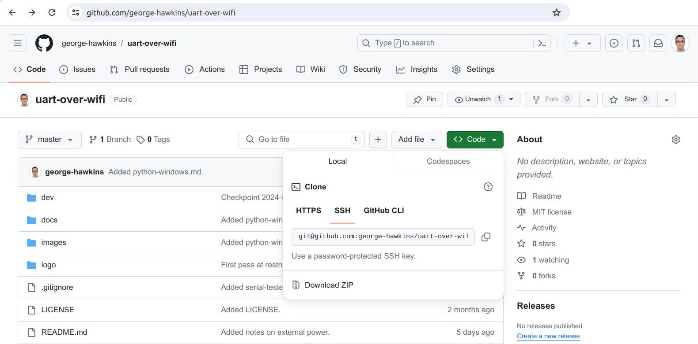
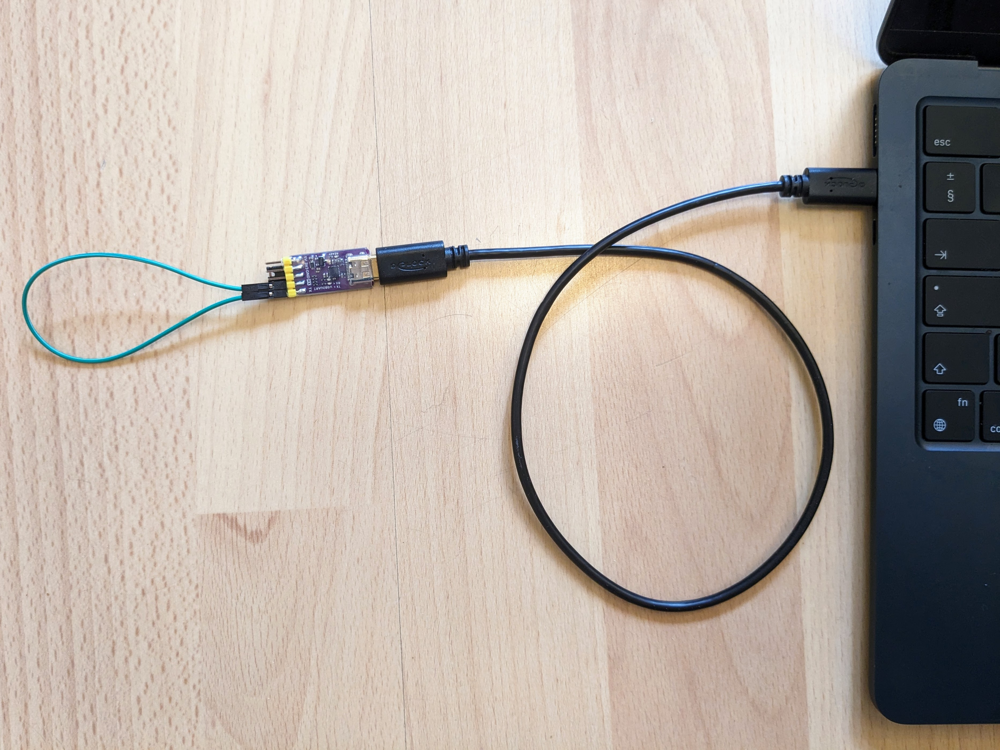
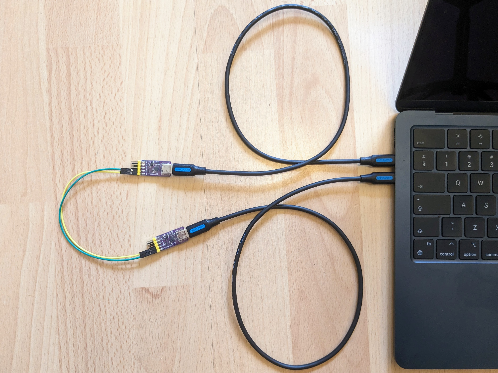
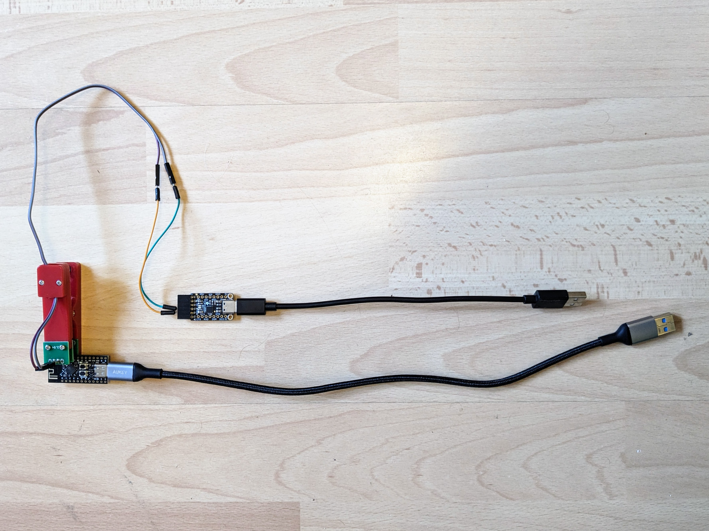
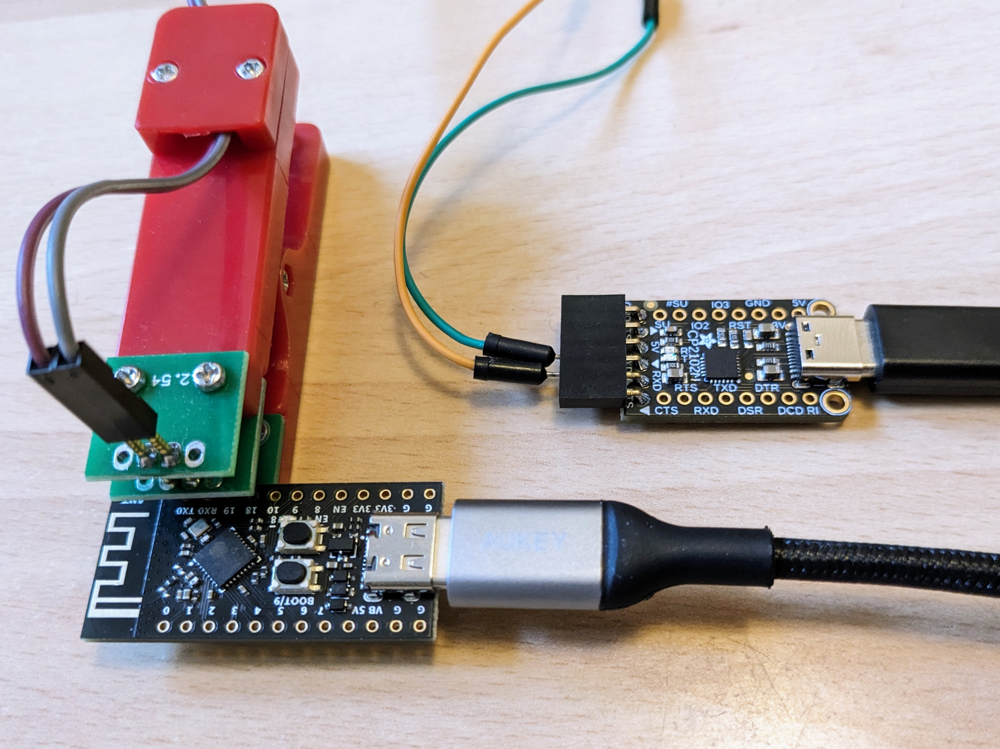
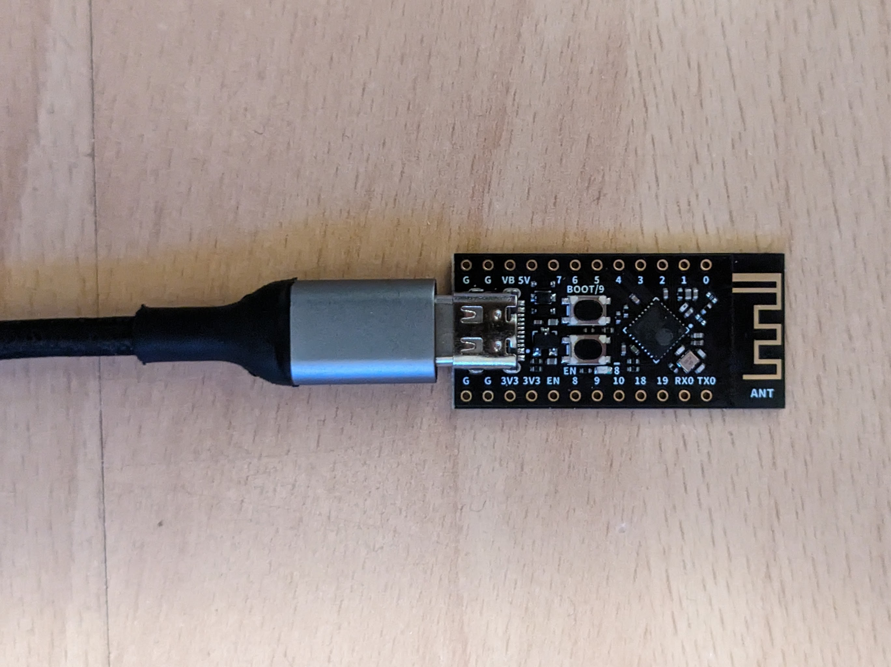

UART over Wi-Fi
===============

UART over Wi-Fi for less than US$10 without any configuration and without any dependency on an existing Wi-Fi network or smartphone hotspot with an easily achievable open-air range of X m. That Wi-Fi is involved is invisible to _both_ ends of the connection.

| Normal wired UART connection | The same connection but wireless |
|------------------------------|----------------------------------|
|  |  |

TODO: include `wireless-connection.jpg` once you have USB-C power adapters. Use two of the Super Mini boards, a Dupont connector and the Pi Pico on a breadboard. And update `wired-connection.jpg` to match this setup (i.e. get rid of the Uno).

There's no magic to this project, it just relies on the fact that you can now get incredibly cheap [ESP32](https://en.wikipedia.org/wiki/ESP32) based boards - combine two of them and they can create their own private Wi-Fi network, discover each other and then pass the UART data back and forward over Wi-Fi.

---

See the [`dev.md`](docs/dev.md) for development notes and [`notes.md`](docs/notes.md) for notes that didn't otherwise fit elsewhere.

Boards
------

There are no end of small cheap ESP32 boards. I've used the C3 variant of the ESP32 almost exclusively and I suggest using an S3 or C3 board as the S and C range of chips have builtin USB support (whereas the original ESP32 requires an external third-party USB-to-serial chip).

You'll need two boards - one for each side of the UART connection. Here are the boards, I recommend:

* [WeAct ESP32-C3 Core board](https://www.aliexpress.com/item/1005004960064227.html)
* [Seeed Xiao ESP32-C3 board](https://www.seeedstudio.com/Seeed-XIAO-ESP32C3-p-5431.html)
* [Seeed Xiao ESP32-S3 board](https://www.seeedstudio.com/XIAO-ESP32S3-p-5627.html)
* [M5Stamp C3U Mate](https://shop.m5stack.com/products/m5stamp-c3u-mate-with-pin-headers)
* [Waveshare ESP32-C3 Mini board](https://www.waveshare.com/esp32-c3-zero.htm)
* [Adafruit QT Py ESP32-C3 board](https://www.adafruit.com/product/5405)
* [SparkFun Pro Micro ESP32-C3 board](https://www.sparkfun.com/products/23484)

The Seeed Xiao is the only one where I suggest an S3 board as an alternative to the C3 variant - the S3 and C3 boards are almost identical (other than the MCU) but the C3 is the only one of the above boards that does not a user controllable LED. This may seem a minor point but I find having a builtin LED can be very useful signalling the state of the board (e.g. flashing the LED while the board is going through the setup phase of establishing a connection).

The Adafruit, M5Stamp and Waveshare boards have a neo-pixel (a WS2812 on the Waveshare board, a WS2812B on the Adafruit board and an SK6812 on the M5Stamp board) while the others have a standard classic SMD LED (except the Xiao C3 which has no user controllable on-board LED).

There are other nice mini boards but I've excluded boards, like the lovely [TinyS3](https://esp32s3.com/tinys3.html) because at US$20, they're significantly more expensive than the boards listed above. [Lilygo](https://www.lilygo.cc/collections/all) is another provider of cheap ESP32 boards - however, their boards tend to be combined with someother device (most commonly an LCD) and all their plain ESP32 boards seem to be a slightly larger form-factor than the ones listed above.

There are no end of no-brand ESP32 boards on AliExpress. However, I suggest you get a board from a clear source like the ones above. There is one no-brand board that I will mention as it appears everywhere - the Super Mini. I've bought these from several different AliExpress stores and they seem to all work fine - for a small section about them and links to the stores, see [`notes.md`](docs/notes.md).

Note: M5Stamp have two very similar C3 boards - the [C3U Mate](https://shop.m5stack.com/products/m5stamp-c3u-mate-with-pin-headers) that uses the ESP32 C3's native USB support and the older [C3 Mate](https://shop.m5stack.com/products/m5stamp-c3-mate-with-pin-headers) where they used an external WCH CH9102 UART-to-USB chip.

Note: I was going to add the DFRobot [Beetle ESP32-C3](https://www.dfrobot.com/product-2566.html) to the list above but I can't see a diode between the VIN pin and the USB power pin in the [schematic](https://dfimg.dfrobot.com/nobody/wiki/d0e8b7f0f042c14f6959c3edc748053b.pdf) (the schematic shows VUSB exposed directly on pin 2 of the P2 header, i.e. the pin labelled VIN on the silkscreen) - if this is really the case, I suggest people avoid this board.

TODO: surely even the no-name Super Mini boards have a diode protecting the USB power pin - confirm this with a multimeter and one of your USB to 2-pin breakouts. Hmm... the Waveshare schematic has the same lack of diode - maybe some people think this is OK?!?

### Antenna

The Adafruit and Waveshare boards above come with a small ceramic chip antenna. The WeAct and SparkFun boards come with an [inverted-F PCB antenna](https://en.wikipedia.org/wiki/Inverted-F_antenna).

The Xiao boards are interesting in that they come with a u.FL antenna connector and a patch antenna. The patch antenna probably isn't significantly better than the other antenna types but the u.FL connector means you choose to use another antenna. Seeed sell a suitable larger [whip-style antenna](https://www.seeedstudio.com/2-4GHz-2-81dBi-Antenna-for-XIAO-ESP32C3-p-5475.html) and many other manufacturers sell antennas in all shapes and sizes for 2.4GHz Wi-Fi with a u.FL connector.

Note: the u.FL connector is one of my least favorite connectors - it's very fiddly and, worse, it's extremely easy to tear these connectors off their boards when trying to remove an antenna (as unlike e.g. USB connectors, they have no through-hole element to anchor them solidly to the board). Seeed have a section on installing and removing such antennas [here](https://wiki.seeedstudio.com/xiao_esp32s3_getting_started/#installation-of-antenna) - they make it look easy, but that hasn't been my experience.

External power
--------------

TODO: table with | WeAct with diode protected VB | Super Mini with diode | Super Mini with power plus via USB | Super Mini power plus via 5V |
 Point out that last one is the only (sometimes) dangerous one. And point out VBAT isn't always diode protected, e.g. Xiao (as they expect you to attach a rechargeable rather than power from another board).

TODO: point out that you need **two** diodes, one protecting the VBUS of your ESP32-C3's USB connector and one protecting the provider of external power. With the WeAct and Adafruit boards you get both on the board. With others you get just the diode protecting VBUS and need to handle protecting the external supply yourself (either with a diode or by routing external power via the USB connector). And amazingly (to me) on some boards, you get neither diode and the only safe option is routing the external power via the USB.

All of the ESP32 boards can be powered via USB. However, you'll typically want your remote device, e.g. a Raspberry Pi Pico, to power the ESP32 board that makes up one end of the UART to Wi-Fi link.

Every ESP32 board has a 5V pin and if the board is connected to USB then you'll see the 5V USB output on this pin.

If you disconnect USB, you can instead power the boardd by connecting an external power source, e.g. the 5V pin from a Pi Pico, to the ESP32's 5V pin.

However, there's a problem if you connect the ESP32 board to USB at the same time that its 5V pin is connected to an external source. You've now got two power sources - the USB power source is protected by a diode that's between it and the 5V pin but there's no such diode protecting the external power source. And this may result in it being destroyed.

In practice, if the other device is something like a Pi Pico powered via USB then it will have its own protection diode and there's no real issue. But you need to be certain this is the situation, e.g. if the other board was being powered by a battery with no recharging circuitry or protection diode then this would be a serious issue.

A safer option is to avoid using the ESP32 board's 5V altogether. The 5V pin supports being both an input and an output but some boards provide an input only pin which has a diode to protect any external source connected to it in the same way that the board's own USB power source is already protected.

On larger boards, this is typically labelled VIN (for "voltage in") but on smaller it may be labelled VBAT, BAT or VB (for "battery voltage"). The BAT bit is just indicative, you can use a battery (e.g. a 4.7V Li-ion battery) but any other power source will also do (as long as it can provide the a voltage in the range accepted by the board's voltage regulator, typically between 4.3V and 5.5V for boards like these ESP32 ones).

The following pins are protected by a diode and safe to use to provide power:

* The VB pin on the WeAct ESP32-C3 Core board.
* The BAT pin on the back of the Adafruit QT Py ESP32-C3 board.

**Important:** the Xiao boards have a BAT pin but it has **no** protective diode (this means a battery can both power the board via this pin and, when power is supplied via USB, be recharged via the pin).

The Xiao, Waveshare and SparkFun boards have no diode protected voltage input pin (and the same is true for many other small boards). But there is another alternative to using the 5V pin for these boards too - you can provide power via a simple USB connector that breaks out its positive and ground pins:



Connect your external source to this and then plug it into the ESP32 board's USB port. Your external source is then protected by the diode meant for USB (and anyway the issue of two power sources goes away as you have to unplug this connector if you e.g. temporarily want to connect the ESP32 board to your laptop to update its firmware).

**Important:** connectors, like the one above have a positive and ground wire. It's best to snip off the ground wire and instead permanently connect a ground pin on your other device and your ESP32 board so, that if you unplug this connector and plug in a USB connection from your laptop, the two boards will still have a common ground.

TODO: include picture of board powered in this way **WITH** the ground wire snipped off.

**Remember:** you don't need to worry about using VIN or VBAT or a USB connector like the one above if the other device is itself powered via USB which will invariably have its own protective diode (though, there are notorious cases of boards, like no-brand blue pill STM32 dev boards, not including this basic element).

If you don't want to bother with a USB connector like the one above and have to use the 5V pin but can't guarantee that the external source already has a protective diode then you just need to add an external diode (like one of these [1N4001 diodes](https://www.adafruit.com/product/755)) between it and the 5V pin.

If you want to check the schematic for a particular board to confirm if it has a voltage input pin, this is what you're looking for (taken from the schematic for the Adafruit QT Py ESP32-C3 board):



Typically, 5V is supplied to the LDO (the voltage regulator that converts the incoming voltage to the regulated 3.3V needed by the board) via the VBUS pin of the USB-C connector. You can see that VBUS is connected to the 5V pin but there's a diode between the two protecting the VBUS source. On the back of the Adafruit board, there's a VBAT pin and, as you can see, this pin also has a diode between it and the LDO (and the 5V pin), this time protecting the external source.

Note: when you have two voltage sources connected to an LDO, each protected by a diode, then the sources will both be fine and the LDO will see the higher of the two voltages, e.g. if you have 5V coming from USB and 4.7V coming from a li-ion battery than the LDO will see 5V (confirmed [here](https://forums.adafruit.com/viewtopic.php?t=209656) and double-checked eleswhere).

Alternatives
------------

TODO:

* WeAct boards
* 433 boards
* Kickstarter board
* Telemetry radios.

### AliExpress

On AliExpress, there are no end of modules from no-name manufacturers (or at least manufacturers who make no effort to maintain a web presence beyond some hard to find Chinese-language site). Most of these modules implement there own protocols, i.e. they're for wireless communication but you have to use some ad-hoc protocol from the manufacturer rather than the device just looking like a UART to the connected devices.

However, some do, like this project, provide a UART interface that's tunneled over wireless. Some use a defined wireless protocol, like Bluetooth, but others use their own proprietary 433MHz or 2.4GHz.

#### The HC-12

These modules come from a [HC Tech](https://www.hc01.com/), a Guangzhou-based company that produces a large range of devices for 433MHz and 2.4GHz (Bluetooth 2.0 and Bluetooth LE). However, for whatever reason, only a few seem to be in common use and widly available.

One such is the HC-12 - a 433MHz module with an advertised range of 1km and maximum rate of 115,200 bps. It uses a SiLabs [Si4463](https://www.silabs.com/wireless/proprietary/ezradiopro-sub-ghz-ics/device.si4463) radio module in combination with a STMicroelectronics [STM8S003F3](https://www.st.com/en/microcontrollers-microprocessors/stm8s003f3.html) MCU.

You can find many YouTube videos (like this [one](https://www.youtube.com/watch?v=vqRqtgvltOI)) and web pages (like [this](https://www.instructables.com/Long-Range-18km-Arduino-to-Arduino-Wireless-Commun/) and [this](https://www.allaboutcircuits.com/projects/understanding-and-implementing-the-hc-12-wireless-transceiver-module/)) explaining how to use it.

There are many randomly maintained and translated versions of HC Tech's own manual for the HC-12 floating around but HC Tech do provide their own [English manual](https://www.hc01.com/downloads/HC-12%20english%20datasheets.pdf) which seems to cover everything needed.

There are no end of AliExpress store that sell the HC-12. Here are some of the bigger ones:

* [HC-12 at All Goods](https://www.aliexpress.com/item/1005001927544982.html)
* [HC-12 at TZT](https://www.aliexpress.com/item/32921079886.html)
* [HC-12 at Simple Robot](https://www.aliexpress.com/item/32369744869.html)

It's generally sold in two variants - one where the MCU is the STM8S003F3P6 which uses the older larger TSSOP-20 packaging and one that uses the STM8S003F3U6 with the newer UFQFPN 20 packaging. The newer packaging adds less than $0.30 to the price and is the one I'd chose.

##### HC-12 range

Of all the modules covered here, the HC-12 should be able to achieve the greatest range. However, apparently many modules sold on AliExpress and elsewhere are clones with an error on the PCB that limits the range to at most 50m. This [video](https://www.youtube.com/watch?v=ZfBuEAH-Q8Y) from DIY Tech Bros covers how to identify this problem and then fix it with some soldering.

In [another video](https://www.youtube.com/watch?v=awOPJK5He28) from DIY Tech Bros, they show that they could achieve a range of 1.8 km - they also recommend a version of the HC-12 sold [here](https://www.banggood.com/Geekcreit-HC-12-433MHz-SI4463-Wireless-Serial-Module-Wireless-Transceiver-Transmission-Serial-Communication-Data-Board-Remote-1000M-p-973522.html) on Banggood rather than an AliExpress store. Tom Heylen who also has a [video](https://www.youtube.com/watch?v=DGRPqeacJns) on, among other things, achieving maximum range with the HC-12 also links to this version of the HC-12.

The HC Tech website has this [picture](https://www.hc01.com/img/home_banner_new.68434575.png) on how to identify a genuine HC-12. However, none of the models on AliExpress or Banggood match the HC Tech image. The DIY Tech Bros say they also managed to buy an HC-12 directly from HC Tech and HC Tech do have a Chinese-language-only online [store](http://www.hc01.shop/productDetail?id=66). Like many Chinese sites, they don't seem to take security very seriously - rather than using HTTPS, they just have a plain unencrypted site. And as far as I can see they only ship to China and Taiwan. The [QQ messenger](https://en.wikipedia.org/wiki/Tencent_QQ) contacts for the HC Tech sales team can be found on their [contact-us page](https://www.hc01.com/contactUs) so, it may be possible to find out where else one can buy genuine boards from them.

#### HC-06 and HC-05

Note: if you're not familiar with Bluetooth, you might think classic Bluetooth 2.0 devices must be less capable than Bluetooth LE devices as LE was introduced as part of the much more recent 4.0 recent revision of the Bluetooth protocol. But LE stands for low energy and while LE devices consume very little power they also operate over a far shorter range. So, if range is important you probably shouldn't go with an LE device. However, as always there are exceptions and some LE devices can transmit at increased TX power levels (e.g. see the WCH CH9143 modules mentioned elsewhere) or may be integrated with a Front-end Module (FEM) that provides increased range.

Both the HC-05 and HC-06 use the Cambridge Silicon Radio (CSR) BC417 radio module. CSR was acquired by Qualcomm in 2015 and the BC417 is now sold by them e.g. [here](https://www.digikey.com/en/products/detail/qualcomm/BC417143B-GIRN-E4/2232203) on DigiKey. However, I can't find a Qualcomm datasheet for the BC417 but you can find CSR versions of the datasheet on various websites (e.g. [here](https://cdn.sparkfun.com/datasheets/Wireless/Bluetooth/CSR-BC417-datasheet.pdf) on the SparkFun site). The other large chip on the board isn't a companion MCU, as I first suspected (it seems the BC417 can handle everything itself), but instead _appears_ to be just a flash memory module - a Macronix MX29LV400.

HC Tech specify the range of these modules as just 10m, i.e. substantially less than the 1km of their HC-12 433MHz module above. However, the HC-12 supports at most 115,200 bps while the HC-05 and HC-06 support up 1,382,400 bps (but higher bps values generally reduce range).

It's hard to find details on what it any differrences there are between the HC-05 and HC-06. It _seems_ to just come down to the fact that the HC-05 can be used in both [master and slave roles](https://learn.sparkfun.com/tutorials/bluetooth-basics/how-bluetooth-works) while the HC-06 can only be used as a slave. If this is correct then it's extremely non-obvious from reading the HC Tech [manual for the HC-06](https://www.hc01.com/downloads/HC-06%20english%20datasheet.pdf) and the [manual for the HC-05](https://www.hc01.com/downloads/HC-05%20english%20datasheet.pdf). Both manuals are very similar but the HC-06 one seems to be more detailed,(in particular the HC-06 has a section on the module's AT commands.

If it's the case that the HC-06 can only be used as a slave module then it's only suitable for use with a Bluetooth master device (such as a smartphone, laptop or a master-capable module like the HC-05). So, if you want a UART over wireless setup where both sides just see a UART interface then you need either:

* Two HC-05 modules with one acting as a master and one as a slave.
* Or one HC-05 modules acting as a master and one HC-06 acting as a slave.

Note: the HC-06 is generally sold with pin header soldered to just four of its six pins - the four you use in day-to-day operation - with the STATE and EN pins left unconnected. While the HC-05 is sold with pin header soldered to all of the modules six pins.

Again the HC-05 and HC-06 are generally sold in two variants, one where the BC417 comes in an older larger packaging form and another using a newer smaller form. I would always go for the smaller newer form (and in this case, the modules using the newer form factor BC417 seem to be the cheaper ones).

The best YouTube video covering using a pair of these device to provide a UART over wireless service is this [one](https://www.youtube.com/watch?v=hyME1osgr7s) from [How to Mechatronics](https://howtomechatronics.com/). Most other videos and sites just covering using one module in combination with a smartphone or laptop with only the side that's physically connected to the module seeing the connection as if it was a classic UART.

Here some of the larger AliExpress stores carrying these modules:

* [HC-05/06 at Tenstar](https://www.aliexpress.com/item/32340945238.html)
* [HC-05/06 at EstarDyn](https://www.aliexpress.com/item/1005002168517770.html)
* [HC-05/06 at Simple Robot](https://www.aliexpress.com/item/33010159305.html)
* [HC-05/05 at RoarKit](https://www.aliexpress.com/item/1871275037.html)
* [HC-05/06 at World of Robots](https://www.aliexpress.com/item/1005004893409587.html)

Note: only some of them have the newer form factor BC417 modules with soldered headers.

#### JDY range

JDY is another popular range of devices found on AliExpress - these devices are appear to be produced by Shenzhen Jindouyun Electronic Technology but other than a few filings [here](https://fcc.report/company/Shenzhen-Jindouyun-Electronic-Technology-Co-L-T-D) with the UC [FCC](https://en.wikipedia.org/wiki/Federal_Communications_Commission), they appear to have no obvious web presence in either English or Chinese.

They produce devices mainly using Bluetooth but also produce some using their own proprietary 2.4GHz protocol for further range than their Bluetooth modules.

Below, I just list some details on some of these modules with links to the most complete PDF manuals I can find for them and links to where they can be bought on AliExpress.

* The JDY-41 with an advertized range of 160m with a maximum rate of 38,400 bpsusing a proprietary 2.4GHz protocol - [JDY-41 manual](https://www.postavrobota.cz/fotky46704/fotov/_ps_2370JDY-41-Manual.pdf) - available from [Simple Robot](https://www.aliexpress.com/item/1005003207184013.html) - there's a variant with an onboard antenna and one with a connection requiring an external antenna (using this you might be able to extend its range even further).
* The JDY-40 - this appears to be an older version of the JDY-41 - it also uses a proprietary 2.4GHz protocol (that is **not** compatible with the JDY-41) but has a lower advertized range of 120m and lower maximum rate of just 19,200 bps - [JDY-40 manual](https://w.electrodragon.com/w/images/0/05/EY-40_English_manual.pdf) - available from [Simple Robot](https://www.aliexpress.com/item/33019680881.html), [TZT](https://vi.aliexpress.com/item/4000319184792.) and [EC-Buying](https://vi.aliexpress.com/item/1005004891495966.html).
* The JDY-31 with an advertized range of 30m with a maximum rate of 115,200 bps using classic Bluetooth 3.0 - slightly different manuals [here](https://adastra-soft.com/wp-content/uploads/2021/06/JDY-31_manual_2.pdf) and [here](https://myosuploads3.banggood.com/products/20190129/20190129043725SKUA87502.pdf) - available from [Wavgat](https://www.aliexpress.com/item/32998624269.html), [Sincere](https://www.aliexpress.com/item/32890543550.html) and [Quason](https://vi.aliexpress.com/item/1005001571180654.html).

Note: like the JDY-41, the JDY-31 has an older less capable version - the JDY-30 which only support half the maximum data rate of the JDY-31 (115,200 bps vs 57,600 bps).

The JDY-31 are the JDY family equivalents of the HC Tech HC-05/06 (it's even reported that they're compatible) but with a greater advertized range.

There are far fewer tutorials and vidoes out there for JDY devices compared to HC Tech devices like the HC-12. But here's [one on the JDY-41](https://www.youtube.com/watch?v=tiuYPqh9sz0) (with accompanying GitHub [repo](https://github.com/RalphBacon/257-Serial-Wireless-Comms)) from Ralph Bacon - interestingly, he compares his experience using the JDY-41 with the HC-12. And here's [one](https://www.youtube.com/watch?v=HxjE9l9xcSs) from Sujit Vasanth and [one](https://www.youtube.com/watch?v=s-lzV_RfZoo) from Antony Cartwright on the JDY-31.

The manual and video linked to above for the JDY-41 show a pair being used, i.e. the devices connected to both ends see a UART connection. Whereas the manual and videos for the JDY-41 just show it being used on its own, i.e. connected physically to a device that sees it as a UART while a smartphone or laptop sees it as a Bluetooth device but _presumably_ if it's similar to the HC-05/06 then it can also be used in a setup where a pair of devices talk to each other.

---

See [`udev-rules.md`](udev-rules.md) for `udev` rules for the WeAct Studio classic ESP32 and EP32-C3 Core boards.

Installation
------------

This section covers installing the server version of UART over Wi-Fi on one of your ESP32 boards and the client version on the other.

The installation requires that you have Python installed on your laptop/PC. If you are using a Mac or Linux then there's nothing to do as Python comes pre-installed on these systems. If you're using Windows then follow the simple instructions [here](docs/python-windows.md).

You can check the version of Python on your machine by opening a terminal (or command prompt on Windows) and entering `python --version`. You should see something like this:

```
$ python --version
Python 3.10.8
```

If you're using a Mac or Linux, you _may_ have to use `python3` instead:

```
$ python3 --version
Python 3.10.8
```

As long as the version is at least 3.6 then all should be fine.

### Download the UART over Wi-Fi project

Go to the UART over Wi-Fi [GitHub page](https://github.com/george-hawkins/uart-over-wifi), click the green _Code_ button and then click _Download ZIP_.



This will download a file called `uart-over-wifi-master.zip`. Unpack this somewhere that's easy to get to when you're working in a terminal or command prompt window, e.g. your home directory on Mac or Linux or `C:\Users\JoeBloggs` (where `JoeBloggs` is your username).

Unpacking the ZIP file will create a new subdirectory called `uart-over-wifi-master`.

Note: if you're already familiar with `git` then I'd suggest cloning the repository rather than downloading and unpacking this ZIP file.

Then open a terminal or command prompt and `cd` into the unpacked `uart-over-wifi-master` directory. You're now ready for the next step...

### Creating a Python virtual environment

A Python virtual environment establishes a well defined Python environment for a project where you're guaranteed that everything is set up correctly and where you're safe from accidentally making changes that affect the rest of the system or unrelated projects and insulated from changes made elsewhere.

Assuming you've opened a terminal or command prompt and have changed directory to the unpacked UART over Wi-Fi project, we can create a virtual environment.

On Mac or Linux do:

```
$ python3 -m venv venv
$ source venv/bin/activate
(venv) $ pip install --upgrade pip
```

On Windows do:

```
> python -m venv venv
> venv\scripts\activate.bat
(venv) > pip install --upgrade pip
```

The first line - `python -m venv venv` - creates the environment (this is a one off step). The next line - `source venv/bin/activate` (or `venv\scripts\activate.bat` on Windows) - activates the environment. And the third line - `pip install --upgrade pip` - is just a nice-to-do step, where we make sure `pip` (the Python package manager) is up-to-date (if it already is, it'll report `Requirement already met` and if not it'll upgrade `pip` to the latest version).

You'll notice that once you activate the environment that the environment name (in this case, the very unoriginal name `venv`) is added into your prompt.

**Important:** if you open another terminal or command prompt (or close and reopen the current one), then you'll need to repeat the activation step - your prompt doesn't contain `(venv)` then you know you've forgotten this step.

Once the environment is activated then all kinds of quirks and issues are eliminated. E.g. the confusion between the `python` and `python3` commands is the result of the infamous switch from Python 2 to Python 3 (which occurred way back in 2008 but still has repercussions today, though thankfully less and less since Python 2 formally reached its end-of-life on January 1st, 2020). In a virtual environment, you can forget about such oddities (and should always just use `python`, knowing that it correctly points to the version of Python that was used to create the environment).

Many non-programmers dislike virtual environments as they introduce an extra step (the need to activate the environment) before you can work on a project. But in the long run (and the short run), they eliminate a lot of problems. If you're reading a Python tutorial and it says you have to e.g. install a package using `sudo` (on Mac or Linux) or from a command prompt (on Windows) that was started using _Run as Administrator_ then it means that things are not being done in a virtual environment and that you're leaving yourself open to all kinds of issues down the line.

Now, that you've got a virtual environment set up, you're ready to start working with your ESP32 boards.

### Installing MicroPython

It's time to install [MicroPython](https://micropython.org/) on your ESP32 boards. This is a slimmed down version designed microcontrollers, like the ESP32 range, and makes developing applications for them far simpler.

The instructions below assume you have an ESP32 C3 board. If you have a classic ESP32 or an S3 then the instructions are almost identical (you just need to change the chip type specified with the `--chip` argument and HERE HERE HERE

Install MicroPython
-------------------

Download the latest firmware:

* For the classic ESP32 [here](https://micropython.org/download/ESP32_GENERIC/).
* For the ESP32-C3 [here](https://micropython.org/download/ESP32_GENERIC_C3/).

For the C3, the choice is easy - there's just one firmware built for this chip so, ignore the preview builds and just select the release build with the latest version number.

For the classic ESP32, there are more firmware choices. For the WeAct Studio [ESP32-D0WD-V3 Mini Core](https://www.aliexpress.com/item/1005005645111663.html) board (and for most other boards that don't have an additional external SPI RAM chip), the relevant firmware is the first one, i.e. the most generic one. When downloaded, it'll have a name something like `ESP32_GENERIC-20240105-v1.22.1.bin`.

Then install `esptool` and `monitor`:

```
$ python3 -m venv env
$ source env/bin/activate
(env) $ pip install --upgrade pip
(env) $ pip install esptool esp-idf-monitor
```

Find the device corresponding to the connected board. On a Mac, you'd do this like so:

```
(env) $ ls /dev/cu.usbmodem*
(env) $ port=/dev/cu.usbmodem1101
```

Then erase the flash on the board and flash the firmware to the board. The following section show these steps for the classic ESP32 and the C3. The steps are almost identical for both, just the `--chip` argument and the `write_flash` address differ.

### Classic ESP32

Erase the flash on the board:

```
(env) $ esptool.py --chip esp32 --port $port erase_flash
```

Flash the firmware to the board:

```
(env) $ esptool.py --chip esp32 --port $port --baud 460800 write_flash -z 0x1000 ESP32_GENERIC-20240105-v1.22.1.bin
```

### ESP32-C3

Erase the flash on the board:

```
(env) $ esptool.py --chip esp32c3 --port $port erase_flash
```

Flash the firmware to the board:

```
(env) $ esptool.py --chip esp32c3 --port $port --baud 460800 write_flash -z 0x0 ESP32_GENERIC_C3-20240105-v1.22.1.bin
```

---

Now, that the firmware is flashed to the board, you can connect to the Python REPL on the board:

```
(env) $ python -m esp_idf_monitor --port $port
--- esp-idf-monitor 1.3.4 on /dev/esp-usb-serial 115200 ---
--- Quit: Ctrl+] | Menu: Ctrl+T | Help: Ctrl+T followed by Ctrl+H ---
...
MicroPython v1.22.1 on 2024-01-05; ESP32C3 module with ESP32C3
Type "help()" for more information.
>>
```

As it tells you, press `ctrl-]` to quit the connection. Try entering `print('hello world')` to get started.

MicroPython stubs
-----------------

To enable PyCharm (and other IDEs) to know about the MicroPython versions of standard libraries (like `os`) and MicroPython specific libraries like `network`:

```
$ pip install micropython-esp32-stubs
```

For more information, see the MicroPython Stubs [documentation](https://micropython-stubs.readthedocs.io/en/main/24_pycharm.html).

Mpremote
--------

Over the years, many different people have created MicroPython tools that go beyond `esp_idf_monitor` and e.g. allow you to copy files to your board.

The tool that now seems to be actively maintained by the MicroPython project is [`mpremote`](https://docs.micropython.org/en/latest/reference/mpremote.html).

Note: there's another package on PyPi called [`mpremote2`](https://pypi.org/project/mpremote2/) but it's not mentioned in the MicroPython docs, I can't find any reference to it in the MicroPython repository, and it's not released by the same maintainers as those listed for [`mpremote`](https://pypi.org/project/mpremote/).

To install it (assuming you've still got the same `venv` active as above):

```
(env) $ pip install mpremote
```

Then to connect to your board (in a similar fashion to above with `esp_idf_monitor`):

```
(env) $ mpremote repl
```

Unlike `esp_idf_monitor`, it doesn't automatically reboot the board before connecting so, it's already just waiting for input - press return to get it to print the prompt again.

Again, it's `ctrl-]` to quit.

To copy a file to the board:

```
(env) $ mpremote cp main.py :
```

See the MicroPython `mpremote` [documentation](https://docs.micropython.org/en/latest/reference/mpremote.html) for more details, e.g. the meaning of the `:` etc.

If a file is named `main.py` then the board will automatically execute it when it starts up.

If a program is running, and you connect to the REPL, you'll have to press `ctrl-C` to stop the program and get to the REPL prompt.

Blinking a LED
--------------

If your board has an LED (most do except for the Seeed Xiao range of boards) then you can write a simple Python program to blink it:

```
(env) $ cat > main.py << 'EOF'
from machine import Pin
from time import sleep_ms

LED_PIN = 8

led = Pin(LED_PIN, Pin.OUT)
v = 0

while True:
    led.value(v)
    sleep_ms(200)
    v = v ^ 1
EOF
```

Change the `LED_PIN` value to match your board, the WeAct Studio ESP-C3 Core board has an LED connected to pin 8 and their classic ESP32-D0WD-V3 board uses pin 22.

And copy it to the board:

```
(env) $ mpremote cp main.py :
```

Boards typically have two buttons - one labeled `BOOT` and one labeled `RST` (reset) or `EN` (enable).

To restart the board without plugging it in and out, press the `RST` (or `EN`) button.

Or you can do:

```
(env) $ mpremote reset
```

Multiple boards
---------------

The above commands are all automatically searching for and operating against the first board they find.

If you've got multiple boards connected then you have to explicitly specify which board to use.

E.g. I've got boards connected on `/dev/ttyACM0` and `/dev/ttyUSB0`. To do an `ls` on a specific board:

```
(env) $ mpremote connect port:/dev/ttyACM0 ls
```

The `connect port:/dev/ttyACM0` tells it which port to use. The `mpremote` documentation lists predefined shortcuts for the commonly used ports on Windows and Linux (and covers how to define additional shortcuts, e.g. if you're using a Mac).

So you can replace e.g. `connect /dev/ttyUSB0` with the shortcut `u0`:

```
(env) $ mpremote u0 ls
```

Instead of using shortcuts, I just used shell variables like so and associated a more obvious name with the two boards I had connected (a classic ESP32 board and a C3 board):

```
(env) $ classic='connect port:/dev/ch340-usb-serial'
(env) $ c3='connect /dev/esp-usb-serial'
```

Then I created [`dev/led_and_button.py`](dev/led_and_button.py) and could copy it to the appropriate board, reset the board and connect to its REPL all in one go like so for the C3 board:

```
(env) $ mpremote $c3 cp led_and_button.py :main.py + reset + repl
```

If you look at [`led_and_button.py`](dev/led_and_button.py), you'll see `BUTTON_PIN = 9` - the `BOOT` button on the board is connected to pin 9 and once the board has started, the `BOOT` button can be used as a normal button (it only does something special if held down while the board is starting up).

So, if `led_and_button.py` is running, and you're connected to the board, it'll print out the current value (1 or 0) of the `BOOT` button each time you press or release it.

Client and server
-----------------

Server:

```
$ classic='connect port:/dev/ch340-usb-serial'
$ mpremote $classic cp server.py :main.py + reset + repl
```

Client:

```
$ c3='connect /dev/esp-usb-serial'
$ mpremote $c3 cp client.py :main.py + reset + repl
```

SSID and passphrase
-------------------

Using just the 26 letters and the 10 digits, you can create base 36 values.

You need a 25 digit base 36 value to encode a UUID.

Generate ten of these with [random.org](https://www.random.org/strings/?num=10&len=25&digits=on&loweralpha=on&unique=on&format=html&rnd=new) and choose any two, one as the SSID and one as the passphrase, and update the `SSID` and `PASSPHRASE` values in both [`server.py`](server.py) and [`client.py`](client.py).

ESP classic read speed
----------------------

The `cl.readinto` operation (where `cl` is the first element of the tuple returned by the socket `accept` call) is quite slow - reading 1024 bytes takes between 1.8 and 2.2ms. Trying to read when there's nothing there takes 0.6ms.

If you can handle 8 * 1024 bits per 2.2ms that's still a respectable 3.7m baud. However, our application has to do various other things in addition to just reading.

Theoretical maximum baud rate
-----------------------------

ArduPilot notes 921600 as a reliable upper limit for STM32 boards - see [`AP_SerialManager.cpp:724`](https://github.com/ArduPilot/ardupilot/blob/2cb177e/libraries/AP_SerialManager/AP_SerialManager.cpp#L724).

For comparison, Betaflight doesn't support above 115200 for GPS or telemetry (see [`ports.js:70`](https://github.com/betaflight/betaflight-configurator/blob/40c243f/src/js/tabs/ports.js#L70) in the Betaflight Configurator) but does support up to 1,000,000 baud for MSP and 2,470,000 for the blackbox,

Select.poll
-----------

At the moment I'm unconvinced there's anything to be gained using the `select.poll` vs just a hard loop of non-blocking reads.

For reference, here's the initial `poll` implementation that I was using:

```
poller = select.poll()
poller.register(cl, select.POLLIN | select.POLLERR | select.POLLHUP)

while True:
    for (s, event) in poller.ipoll(0):
        if event != select.POLLIN:
            # TODO: raise exception.
            print(f"got unexprected event {event}")
        elif s != cl:
            # TODO: raise exception.
            print(f"got unexprected object {s}")
        else:
            count = cl.readinto(buffer)
            if count is not None:
                print(count)
```

Effective speed
---------------

Maximum speeds reading and echoing back data.

UART0 over USB:

* C3: ~300 kbps (with baud rate set to 460,800)
* Classic (with CH340K serial-to-USB chip): ~114 kbps (with baud rate set to 115,200) 

UART1 via CP2102N:

* C3: ~1.75 mbps (with baud rate set to 1,843,200)
* Classic: ditto

Reading a byte at a time
------------------------

Reading and writing via a `machine.UART` instance, where non-blocking reads of as many bytes as are currently available in a single `readinto` call, is extremely efficient and one can effectively consume all available bandwidth up to 1,843,200 baud (which is effectively the top speed of my CP2102N based [serial to USB converter](https://www.adafruit.com/product/5335)).

But with UART0, one has to work through the blocking `sys.stdin` and this forces us into polling and reading at most one byte at a time. On a C3, a hard poll-read-write loop of a byte-at-a-time maxes out ~300kbps.

It's the performance of this loop rather than the underlying read and write operations that becomes the limiting factor.

The MicroPython documentation contains a [maximizing speed](https://docs.micropython.org/en/latest/reference/speed_python.html) page.

I tried all the suggestions - things like caching object references didn't noticeably affect speed (maybe the interpreter has been improved since this page was written) and the most interesting looking thing, the `@micropython.viper` decorator, isn't supported for C3 - as of Feb 24th, 2024, [`ports/esp32/mpconfigport.h`](https://github.com/micropython/micropython/blob/master/ports/esp32/mpconfigport.h) only supports emitting machine instructions for the Xtensa ESP32 chips:

```
#if !CONFIG_IDF_TARGET_ESP32C3
#define MICROPY_EMIT_XTENSAWIN              (1)
#endif
```

Surprisingly, the biggest gain was achieved on the basis of the advice in the [_Variables_ section](https://docs.micropython.org/en/latest/develop/optimizations.html#variables) of the _Optimizations_ page. In my tests, I'd created various variables in the global scope. Simply shifting everything into a function and calling that increased the effective throughput from ~200kbps to ~300kbps.

I.e. I started with variables like `poller` existing in the global scope:

```
poller = select.poll()

while True:
    for _, event in poller.ipoll():
        ...
```

Simply moving things into a function greatly increases performance:

```
def run()
    poller = select.poll()

    while True:
        for _, event in poller.ipoll():
            ...
            
run()
```

I suspect that a better approach than optimization like this would be an update to MicroPython to enable non-blocking reads on `sys.stdin` so that `readinto` can be used to read more than a single byte as one is currently constrained to do.

Development
-----------

I asked two questions about using UART0, i.e. the UART that runs over the board's USB port. The replies to both weren't particularly useful (I don't think I was well understood on either) but they worked well for [rubberducking](https://en.wikipedia.org/wiki/Rubber_duck_debugging).

I asked the first question [here](https://github.com/orgs/micropython/discussions/13696) on the in the ESP32 section of the MicroPython discussion forums. At this point I didn't yet understand that while one could create a `machine.UART` instance for UART0, it wasn't actually useful for anything beyond reconfiguring _some_ of the attributes associated with `sys.stdin` and `sys.stdout` and was not directly useful itself (e.g. one cannot call `read` or `write` on it).

My second question is [here](https://github.com/micropython/micropython/issues/6862#issuecomment-1958038625), I added it as a comment on the existing issue [_ESP32 UART 0 changing the baudrate #6862_](https://github.com/micropython/micropython/issues/6862). My [second comment](https://github.com/micropython/micropython/issues/6862#issuecomment-1959075926) there, summarizes my current understanding of things.

Once one understands that one can change the UART0 baud rate through the `machine.UART` constructor or its `init` method but that one then has to work with `sys.stdin` and `sys.stdout` (and that non-blocking reading seems not be currently supported), then the only important thing to be aware of is that the following error is harmless:

```
E (3769) uart: uart_wait_tx_done(1115): uart driver error
```

Each time, I tried to alter the baud rate, MicroPython output this error. I thought this meant things hadn't worked, but actually it appears to be harmless and is output whenever you change some attribute or other of UART0.

### Development scripts

I developed a number of small scripts/programs that are included in this repo.

As I often work with multiple boards, I generally create shell variables to let me easily distinguish between them when using `mpremote`, like so:

```
$ client='connect /dev/ttyACM0'
$ server='connect /dev/ttyACM1'
$ mpremote $server cp server.py :main.py + reset
$ mpremote $client cp client.py :main.py + reset
```

So, below wherever you see `$esp32c3` take it as having been set up to expand to `connect /dev/ttyACM0` (or whatever port the board is connected to).

#### LED and button

The [`dev/led_and_button.py`](dev/led_and_button.py) script demos using the board's LED and BOOT button. This is useful if you need some simple input and output. The pin values in the script work on both my WeAct C3 board and my no-name Super Mini C3 board.

```
$ mpremote $esp32c3 cp led_and_button.py :main.py + reset + repl
```

The LED will blink on and off and if you press the BOOT button, you'll see 1 or 0 being output.

The [`dev/led_interrupt.py`](dev/led_interrupt.py) script demos using a timer to blink the LED while the MCU is doing something else:

```
$ mpremote $esp32c3 cp led_interrupt.py :main.py + reset
```

The LED blinks even while the device is sleeping.

### Serial tester

[`dev/serial-tester.py`](dev/serial-tester.py) is a program that's meant to be run on your laptop and desktop, and it used in combination with all the following scripts to test serial port through put.

It requires two arguments:

* `--port`, e.g. `--port /dev/ttyACM0`
* `--baud-rate`, e.g. `--baud-rate 115200`

It then writes out blocks of bytes with a particular structure (with a timestamp and a CRC) and expects to receive similar blocks back. At intervals, it then out it then outputs statistics about throughput and errors. If the connected hardware isn't doing its job or is overwhelmed and generates invalid blocks then this program will spam your terminal with `?` characters and `Desynced` warnings or just sit there dumbly if it gets no input at all.

The logic is slightly more complicated than you might expect as it paces itself in writing to the given port rather than just writing as fast as it can. This is because the underlying system buffers are surprisingly large so, one can essentially write at huge speeds for short bursts before being blocked for long periods as the underlying bytes are written out (for reasons that aren't clear to me, you can write a lot of data and are then blocked for a long period as if the underlying buffer has to completely clear before you can write again, I would have expected that one could fill the buffer initially and then wait much shorter periods as small blocks of the underlying buffer become free that one can then write to).

The start-stop nature of letting the system block you as you hit buffer limits results in program that's in a continuous cycle of freezing and recovering. So, instead the program calculates the maximum rate it can transmit as given the current baud rate and paces itself accordingly.

TODO: include photo of two CP2102N serial-to-USB converters connected to each other and plugging into a USB hub. Then explain that one can run two instances of `serial-tester.py`, one talking to each converter and demonstrate the simplest case of just pumping serial data between two USB ports on your desktop/laptop.

| Serial-to-USB - TX connected to RX | Two Serial-to-USB converters |
|------------------------------------|------------------------------|
|  |  |

### UART1 scripts

| C3 and USB-to-serial converter                       | Close-up                                                               |
|------------------------------------------------------|------------------------------------------------------------------------|
|  |  |

Note: in the pictures just the RX and TX pins are connected. Normally, you'd also connect the ground pins but here everything is already has a common ground so this isn't necessary.

These scripts are very simple and just read data from UART1 and echo it back, with UART1 is set up to use pins 20 and 21.

Somewhat confusingly, these are the pins labelled RX0 and TX0 on my WeAct C3 board - confusing because unlike a classic ESP32 where these are just the same pins as the ones that are wired through to the board's serial-to-USB converter chip, i.e. UART0, these pins do not correspond to UART0 so, I think, '0' shouldn't be included in labelling these pins.

These scripts, like the others below, bundle the main logic into an apparently pointless `run()` function - this is because of the difference in handling of global variables and variables with global scope (see notes on MicroPython specific speed optimizations above). Be careful to also use `micropython.const` with any values that aren't just used in one-off setup tasks, e.g. if you declare a global variable `BUFFER_SIZE` and then use it in one of the tight loops of these programs.

The [`dev/uart1_demo.py`](dev/uart1_demo.py) is the simplest, just copy it to a ESP32 C3 board that's connected to a USB-to-serial converter as shown above:

```
$ mpremote $esp32c3 cp uart1_demo.py :main.py + reset + repl
```

This and the other UART1 script are nice because you can leave `mpremote` running in `repl` mode and watch for any errors there.

With the board plugged into one USB port (and e.g. appearing as port `/dev/ttyACM0`) and the serial-to-USB converter plugged into another (and e.g. appearing as port `/dev/ttyACM1`), run the `serial-tester.py` program against the port correspond to the serial-to-USB converter with e.g. `--port /dev/ACM1 --baud-rate 1843200` where the specified baud rate matches that seen at the top of `uart1_demo.py`:

```
BAUD_RATE = 1843200
```

If all goes well, the `serial-tester.py` program should, after several seconds, output something like this:

```
.........
Effective speed: 1,779,852 bps
Blocks received: 13906
Latencies: min=1 ms, median=2 ms, max=4 ms
Bad CRCs: 0
Desynced: 0
Discarded: 0
```

You can try adjusting the `BAUD_RATE` value in the script (to the various common baud rates, i.e. 9600, 19200, 38400, 57600, 112500, 230400, 460800, 921600 and 1843200) and remembering to also update the `--baud-rate` argument passed to `serial-tester.py`.

I found the hardware UART connected like this to a serial-to-UART converter had no problem reaching the maximum speed supported by my converter, i.e. 1843200.

The other UART1 script is [`dev/uart1_demo_poller.py`](dev/uart1_demo_poller.py) is just the same script but rewritten to use [`Poll.ipoll`](https://docs.micropython.org/en/latest/library/select.html#select.poll.ipoll).

### UART0 scripts

This setup is simpler and just involves the board on its own without a serial-to-USB converter:



Working with UART1 worked exactly as expected. Working with UART0 proved to be more involved. It's the UART used for communication via the board's USB port and is used by the MicroPython REPL. While you can create a `machine.UART` instance corresponding to UART0, you have to work with it (as noted above) via `sys.stdin` and `sys.stdout`.

The fact that the original ESP32 didn't come with built-in USB support means that with classic USB boards performance depends on whatever serial-to-USB chip the board manufacturer chose to use on their board. The S and C series chips come with built-in USB support.

Compared to UART1, I got very poor through-put with UART0 - with my classic ESP32 board maxing out at around 115200 baud and my ESP32 C3 boards maxed out at around 230400 baud. The reasons the C3 boards maxed out at such low speeds is, I believe, to the lack of non-blocking support for `sys.stdin` that force you to use `Poll` and a byte-at-a-time reading in order to get non-blocking like behavior. _I think_ working a byte-at-a-time rather than being able to read as many bytes as are currently available into a buffer in one operation (as one can with UART1) is what results in the far lower maximum through puts.

Using UART0 and disabling ctrl-C (as one has to if one wants to send binary data as pressing ctrl-C is just the same as sending the byte 0x03) makes working with these scripts much more of a nuisance than working with UART1. You essentially disable your ability to return to the REPL and upload further scripts.

So, I often included something like the following at the top of these scripts:

```
# Give myself a chance to bail and upload a new program.
print('Press ctrl-C now to exit')
time.sleep(3)
print("Taking control of the USB UART")
time.sleep_ms(200)
```

I.e. these lines give me 3 seconds to press ctrl-C and retake control of the board before the program runs on to take the USB port for itself (or at least the virtual serial port aspect of things). So, I'd hit the board's RESET button and quickly do:

```
$ mpremote $esp32c3 repl
```

And press ctrl-C and so then be able to upload my next script. But if you do this, remember to only start `serial-tester.py` once the 3 seconds are up.

The first script is the simplest, it wraps the unusual behavior of UART0 up into the class `UsbUart0` (found in [`dev/usb_uart0.py`](dev/usb_uart0.py)) and then demos it with [`dev/usb_uart0_class_demo.py`](dev/usb_uart0_class_demo.py):

```
$ mpremote $esp32c3 cp usb_uart0.py : + cp usb_uart0_class_demo.py :main.py + reset
```

As before the script contains a `BAUD_RATE` value. This time there's no serial-to-USB converter involved - you just run the `serial-tester.py` program against the port corresponding to the board.

If you get into a state where you can't interact with the board with `mpremote` the only solution is to erase the chip and reflash MicroPython - erasing the chip first is important as otherwise the script that's taking control of UART0 will survive the reflashing process and start running again immediately. So, for a C3 board, this would involve:

```
$ port=/dev/ttyACM0
$ esptool.py --chip esp32c3 --port $port erase_flash
$ esptool.py --chip esp32c3 --port $port --baud 460800 write_flash -z 0x0 ESP32_GENERIC_C3-20240105-v1.22.1.bin
```

In the end, I decided the `UsbUart0` class didn't buy much and switched to doing everything in the single script [`dev/usb_uart0_demo.py`](dev/usb_uart0_demo.py) which can be used in the same way as the previous scripts:

```
$ mpremote $esp32c3 cp usb_uart0.py : + cp usb_uart0_demo.py :main.py + reset
```

And run `serial-tester.py` with its baud rate matching the `BAUD_RATE` in the `usb_uart0_demo.py`.

This script is a little fancier in that it wraps the main loop in a `try`, if an exception occurs it store it in a variable named `failure` and restores the normal UART0 baud rate and ctrl-C behavior so that you can connect to the REPL and e.g. do `print(failure)`.

In practice, I never hit any exceptions with this code.

The final script, in this section, is [`dev/usb_uart0_demo_buffered.py`](dev/usb_uart0_demo_buffered.py), where I experimented with caching object references (see optimization notes elsewhere in this document) and buffering the read bytes so that more than one could be written out per `write` call. These changes did **not** improve performance.

---

Exposed pins
------------

When creating a connection between my main dev board and the ESP32, I've used male and female 4-pin Dupont connectors.

Dupont connectors are traditional in this kind of breadboarding prototyping environment, but usually I'd prefer a connector, like this [4-pin JST SM one](https://www.adafruit.com/product/578), where the male pins are shrouded to protect them against accidentally shorting against something.

If I do have to use a connector like the Dupont then I generally put the female connector on the side that's supplying power. So, e.g. if the dev board is supplying power and the ESP32 board is consuming power then when the two are unplugged, it'll be the unpowered device that has the connector with the exposed male pins.

TODOs
-----

Add a closenss warning about holding a TX too close an RX (I presume Bluetooth devices and possibly WiFi automatically correct for this?!?) such that the RX is overwhelmed and _appears_ to lose signal - flooding / shouting / overwhelming.

No driver was needed for basic CDC with serial-to-USB boards from WeAct - the website says a driver is only needed for VCP functionality but I don't know what that might add.

My Seeed 2.4GHz rod antenna looks like [this](https://photos.app.goo.gl/tPJskZSCJvL1P1wK6) if you remove the protective plastic shell. This is a printed dipole antenna which is a type of PCB trace antenna.

### Antennas

I bought sleaved-balum antennas here:

* Ecmail: <https://www.aliexpress.com/item/4000127092025.html>
* Samiore: <https://www.aliexpress.com/item/4001081855333.html>
* TZT: <https://www.aliexpress.com/item/4001095606059.html>

It turns out Ecmail also sell there's in smaller packs of 5: <https://www.aliexpress.com/item/32907219209.html> - and perhaps the others do too.

I also later bought ones from:

* EC-buying: <https://www.aliexpress.com/item/1005004731400160.html>
* Weinuo: <https://www.aliexpress.com/item/1005003522086976.html>

