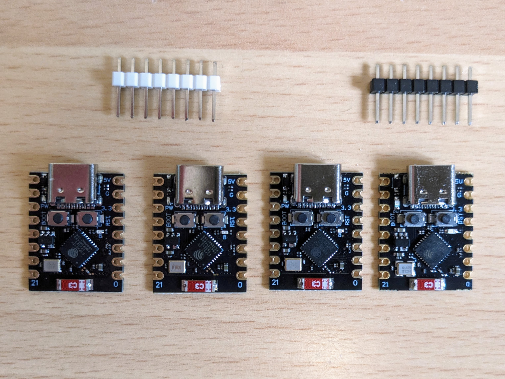
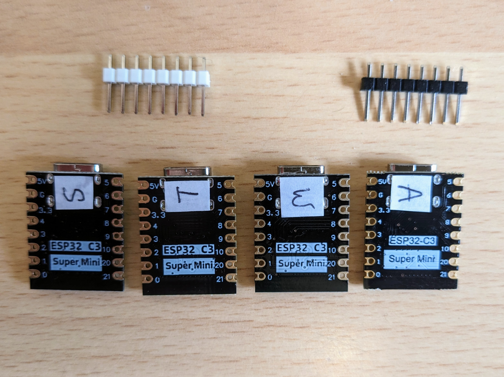

Notes
=====

This page includes notes that don't otherwise fit into the main [`README.md`](../README.md) or [`dev.md`](dev.md) pages.

Logos
------

I got two logos designed for this project using designers found on [fiverr](https://www.fiverr.com/).

The first was designed by [Martina D](https://www.fiverr.com/cosmicbeauty2) (aka @cosmicbeauty2) and the second by [Abhi C](https://www.fiverr.com/mrtranscendence) (aka @mrtranscendence).

In many ways, I find the second logo more "fun" and the connector on the left hand side is even more clearly a 4-pin Dupont connector, but for the moment I've gone with the first logo.

Super Mini comparison
---------------------

From left-to-right below, the Super Mini boards from the Samiore, Tenstar, Win Win and All Goods stores on AliExpress:

| Top | Bottom |
|-----|--------|
|  |  |

The ESP32 C3 Super Mini is an unbranded Xiao form-factor board sold by many AliExpress stores.

At this stage, it seems impossible to find out who designed and produced the original Super Mini. The documentation (generally poorly reproduced) that accompanies it on the various AliExpress stores looks to have been copied from one of the Xiao boards (from Seeed, who originally popularized this form-factor) and adjusted slightly to reflect any Super Mini specific differences.

I've bought the Super Mini from several AliExpress stores and while almost identical there are some differences:

Arbitrarily taking the [Win Win store](https://www.aliexpress.com/item/1005005757810089.html) version as a baseline and comparing:

* The [Samiore store version](https://www.aliexpress.com/item/1005005955099518.html) has larger vias, clearer Super Mini logo on bottom, very slightly less clear silkscreening on top.
* The [Tenstar store version](https://www.aliexpress.com/item/1005005877531694.html) has same small vias as Win Win, logo similar or clearer than Samiore, clearest silkscreening on top and bottom.
* The [All Goods store version](https://www.aliexpress.com/item/1005005968621523.html), this is the most clearly different, it comes with black headers rather than white, the others have a square-tooth join on the seam of the USB-C connector, this has a straight line, the routing is clearly different from the other three, the [panelization](https://www.pcbway.com/blog/PCB_Basic_Information/What_is_PCB_Panelization_PCB_Knowledge_eaf7e88f.html) was done using tabs while the others look to be done with V-scoring and the power and pin-8 LED are slightly larger. The other three came in a normal anti-static bag (the tear-open kind rather than resealable) while this one came with a cheaper (but still anti-static grey) bag (with a fold-over seam down its length and a zig-zag pattern along the top and bottom edges as the tear points rather than a little notch on the side like the others). The vias are small, i.e. the same as Win Win and the slightly-indented lines you see on the surface (corresponding to the routing) are slightly finer and clearer than on the other boards.

The Win Win, Samiore and Tenstar boards are so similar they could just be just different runs from the same maker. The one from All Goods is the only one that's clearly different (although the placing of all the SMD components is identical) but it's not clearly better or worse than the others.

In the end, it's probably just easiest to go with a branded board from a clear source like WeAct, Seeed, WaveShare, Adafruit or Sparkfun.

### Shipping

The Tenstar board was the only one that used AliExpress to handle the shipping. This can make a big difference when buying several items at the same time from different stores on AliExpress - if total value of items where AliExpress handles the shipping goes over a very low limit then the shipping for those items is free but stores that handle their own shipping only take into account the value of items from their own store and apply their own limits before providing free shipping.
