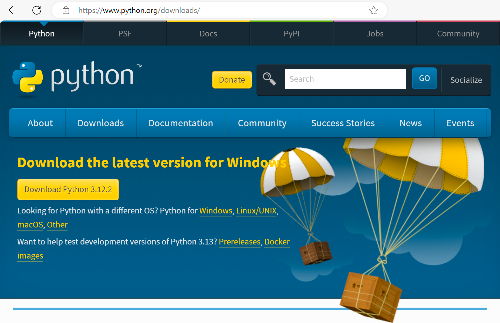
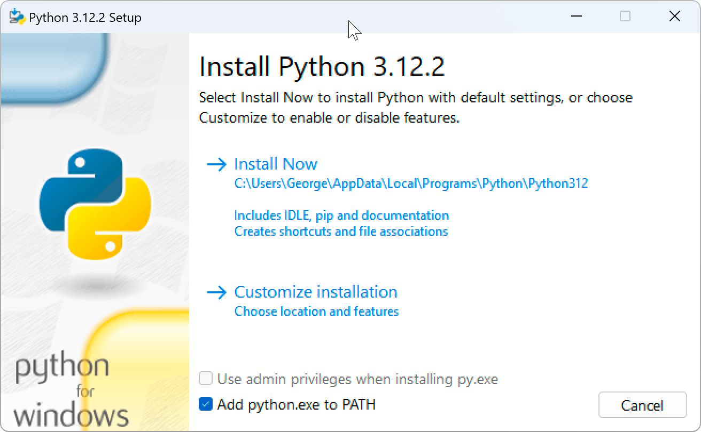
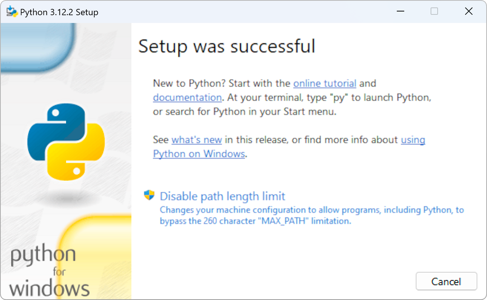
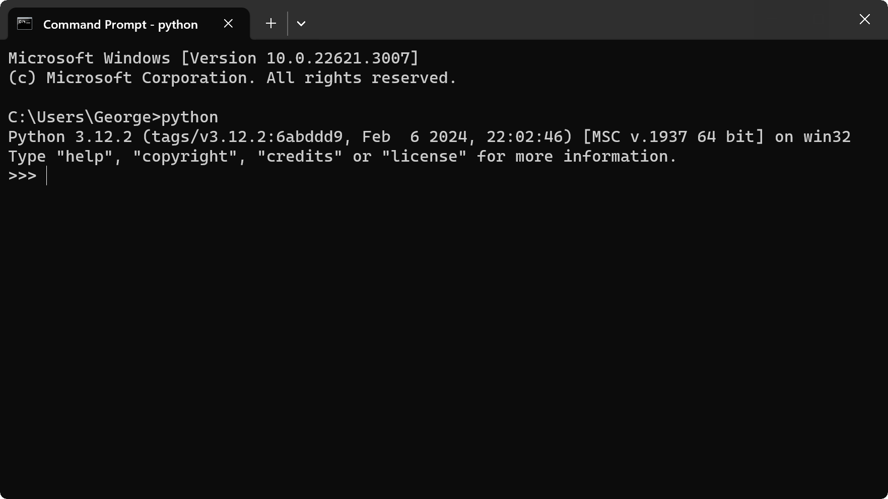

Installing Python on Windows
============================

There are no end of web pages and YouTube videos on how to do this so, I won't go into installing Python on Windows in-depth here. If you run into problems then just google for a more in-depth walkthru.

This page was written on April 6th, 2023 - if you find it months or years later then things may have changed since.

You can install Python via the Microsoft Store. In fact if you open a command prompt and enter `python`, it'll offer to install it from the store for you.

However, at the moment the consensus seems to be that it's better to just install it directly from the main Python site.

So, go to the downloads page <https://www.python.org/downloads/> and click the big yellow download button.

Open the downloaded installer and, on the first page, **make sure to tick the "Add python.exe to PATH" checkbox**. If you don't do this then `python` will continue to point to the thing that offers to download Python from the Microsoft Store.

On the final page of the install process, it gives you an option to disable the default 260 character path length limit. This is a limit that's a hang-over from Windows pre-history and there's no real downside to getting rid of it and doing so eliminates a serious issue for some Python packages that involve deep nested paths.

Note that it suggests using `py` to launch Python. This is a Windows-specific Python launcher that bypasses the Microsoft Store `python` issue mentioned above but also introduces some issues of its own (such as how it interacts with Python virtual environments).

But, as you ticked the "Add python.exe to PATH" checkbox above, you can use `python` rather than `py` and should do so.

Now, that you've installed Python, open a new `cmd` prompt (don't use one that you may already have had open as it won't know about the PATH change made by the installer) and enter `python`:

If all has gone well, it'll print the installed Python version (3.12.2 in the image above) and show the Python `>>>` prompt.

You can exit by entering `exit()` - don't forget the `()`. This interactive version of Python is commonly called the Python [REPL](https://realpython.com/python-repl/).

However, for the UART over Wi-Fi project, that's the last time you'll need to interact with Python directly like this - it just needs to be there to be used by other tools.
