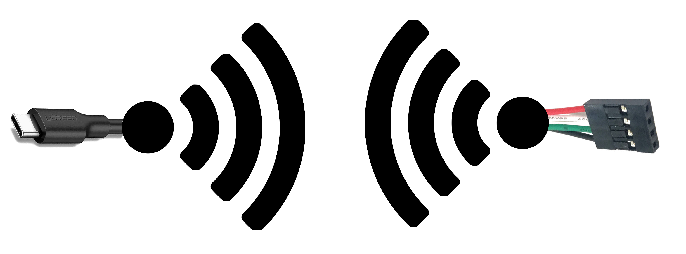
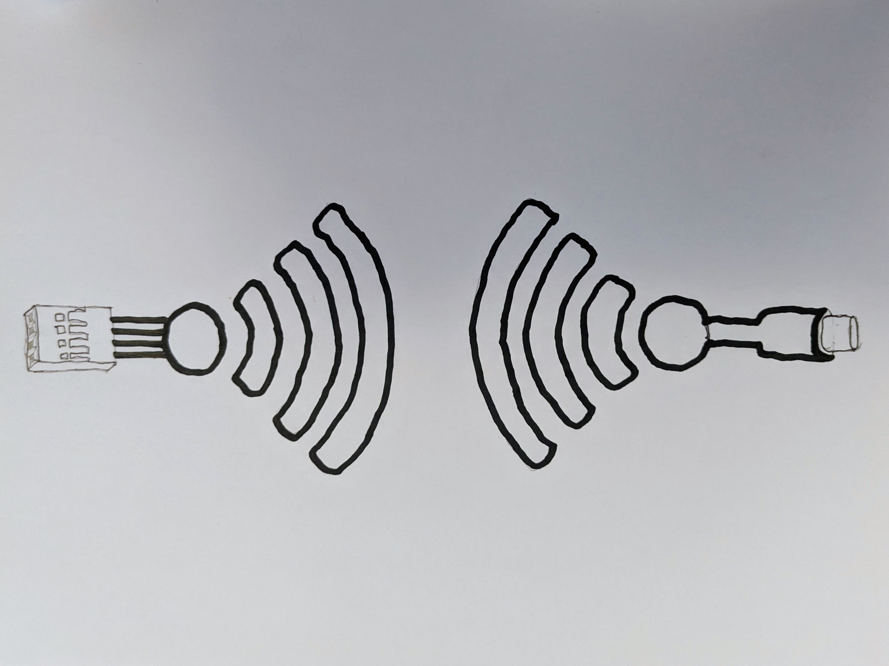
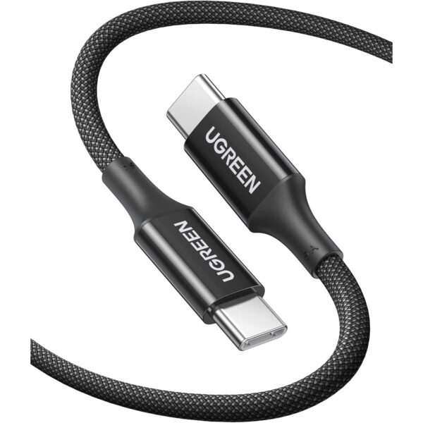
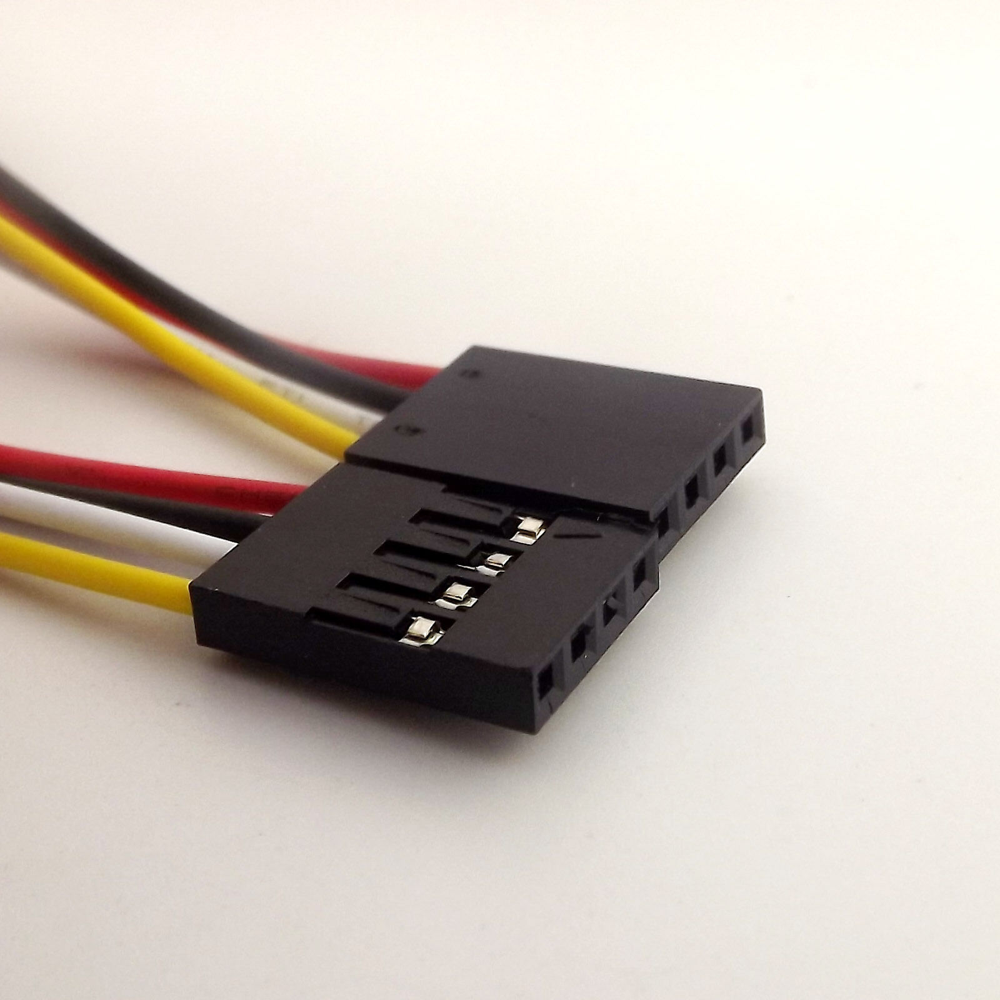
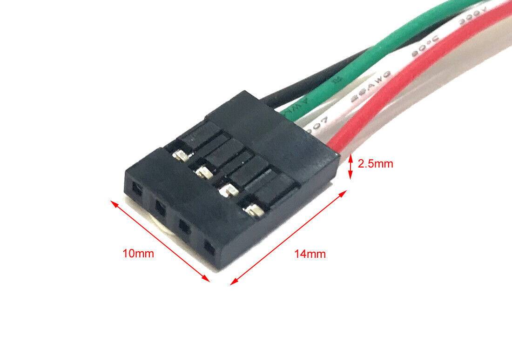
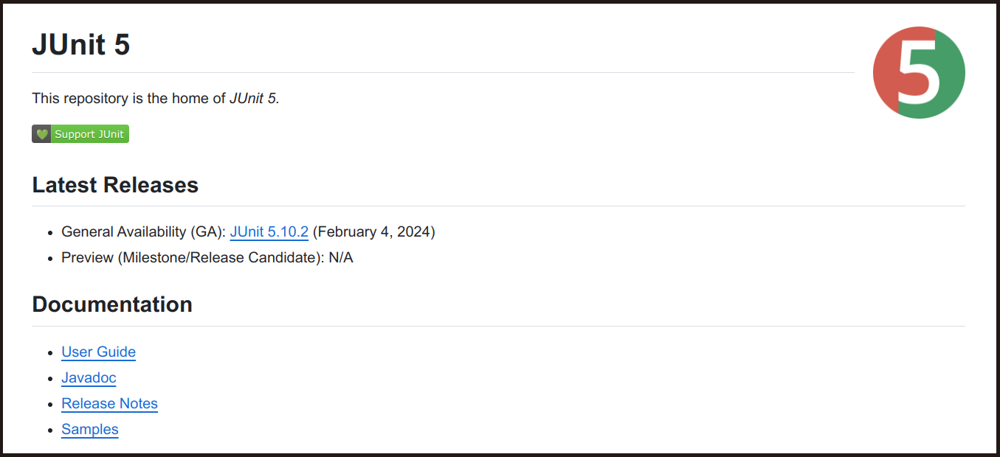
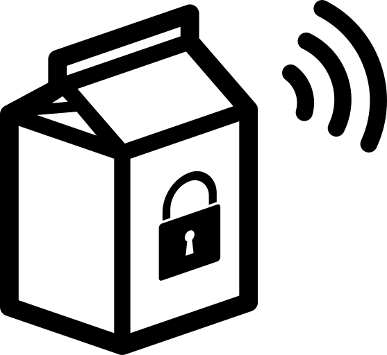

Logo design
===========

I'm looking for small simple b&w (or minimal colors) logo for an open source software/hardware project.

I don't want an abstract design - I'd like a design that's a visual representation of what the project does.

What it does: at one end there's a USB-C connector and at the other end a different kind of connector (called a 4-pin Dupont connector) and data is transfered between the two using Wi-Fi.

This is my first shot at representing things - first a terrible mock-up and then something I drew with pen (where I also staightened up the connectors a bit):

| mock-up | pen drawing |
|---------|-------------|
|  |  |

The two connectors are very recongnizable to everyone in the space that I'm targetting.

At one end a generic USB-C connector, the kind of thing everyone knows, like this:

At the other end, the less well known 4-pin Dupont connector:

| 4-pin Dupont | 4-pin Dupont | Technical drawing |
|--------------|--------------|-------------------|
|  |  |  |

The most recongnisable thing about the Dupont connector is how the holes, at the end of the connector, are inset from the connector's "shell", i.e. the shape seen in the upper-left of the right-most image above. Note: the right-most image shows 5-pin and 6-pin variants of this connector - in my setup, I'm using just a 4-pin connector.

But for a logo, I think, this insetting of the holes is a detail that is too small to capture.

The logo will be used in a similar context to this logo here (the &#x277A; on the right-hand side):

So, take this as a guide to the expected display height (if my logo has a much wider width that is OK).

This is an example of a logo, I had made previously for something similar, that I liked (as a guide to my taste in logos):

If you're willing to provide more than one concept then I'd like one that closely matches the pen drawing above (but with your artists eye to proportion, line weight etc.) and one where you are a bit freer to come up with your own idea.
